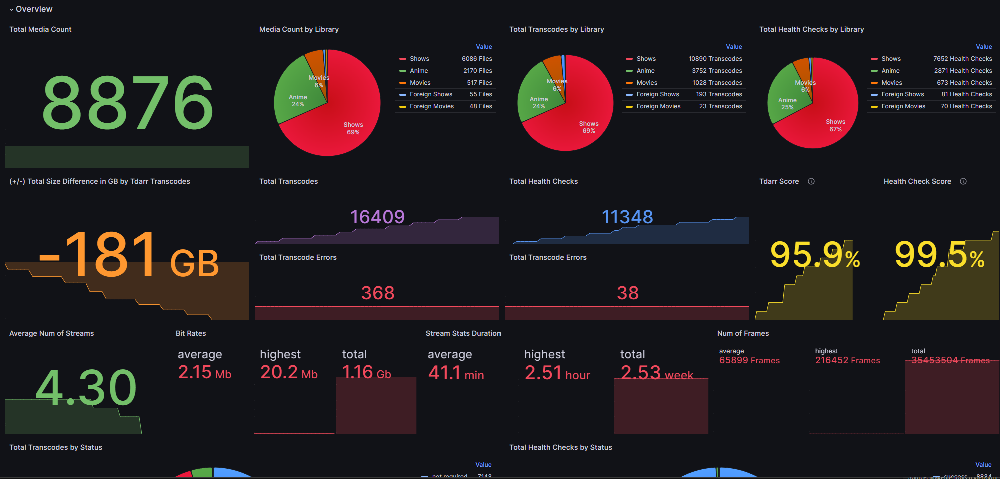
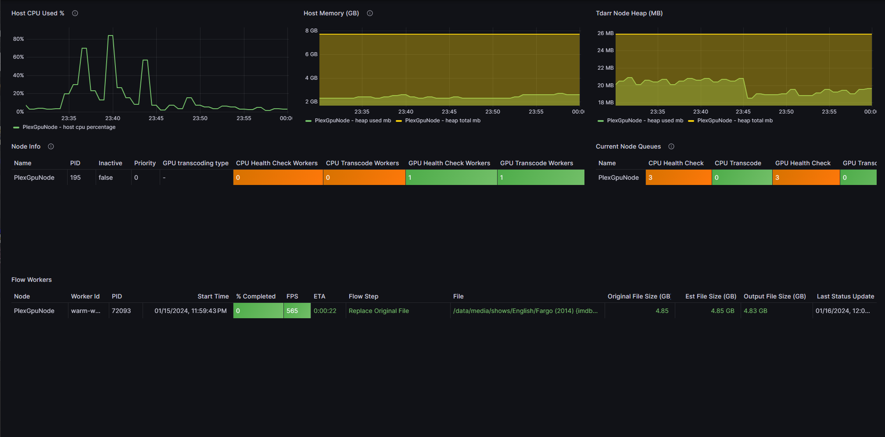

# tdarr-exporter
- [tdarr-exporter](#tdarr-exporter)
  - [Background](#background)
  - [Usage](#usage)
  - [Configuration](#configuration)
  - [Dashboard](#dashboard)

## Background
`tdarr-exporter` is a Prometheus collector for [Tdarr](https://github.com/HaveAGitGat/Tdarr) and provides the following as Prometheus metrics:

1. General instance and library statistics (as shown in Tdarr's statistics page).
2. Current queues and counts.
3. Progress updates for running transcode and health check jobs.

Some samples below from Grafana, check `examples/` for more samples and a complete view of metrics.



Progress updates are provided for following:
1. CPU/GPU Flow plugin jobs
2. CPU/GPU Classic plugin jobs
3. CPU/GPU health check jobs

Inspired by exportarr and qbittorrent-exporter projects. I wanted to have everything in Grafana so I don't have to check everywhere.

## Usage
`tdarr-exporter` can be run from in the following ways:

1. Docker container
2. Executable binary
3. Helm chart (K8)

### Binary
Each tagged release will include executable binaries under the `assets` section of the release notes. This can be downloaded and run directly, see [configuration](#configuration) section for more details on run options.

`./tdarr-exporter -url=example.com`

A variety of platforms (`darwin`, `linux`, `freebsd`, `openbsd`) are supported and include `386`, `amd64`, and `arm64` variants.

### Docker
Docker images are provided for `linux/amd64` and `linux/arm64` variants only at the moment.

| tag | description |
| --- | ----------- |
| `latest` | Latest stable release and is updated with each new release. |
| `X.X.X`  | Semantic versioned releases are also provided if preferred for stability or other reasons. |
| `main` | This tag reflects the `main` branch of this repository and may not be stable |

To run this image, the `URL` should be provided, and more options can be supplied if needed. See [configuration](#configuration) section for more details.

`docker run -e TDARR_URL=example.com -p 9090:9090 homeylab/tdarr-exporter:latest`

### Helm
`tdarr-exporter` can be deployed to Kubernetes using the provided Helm chart. The chart is available in a separate [repository](https://github.com/homeylab/helm-charts/tree/main/charts/tdarr-exporter).

## Configuration
`tdarr-exporter` accepts the following variables for configuration via the cli or environment variables.

Example
```bash
$ ./tdarr-exporter -h
  -api_key string
        api token for tdarr instance if authentication is enabled
  -http_max_concurrency int
        maximum number of concurrent http requests to make when requesting per Library stats (default 3)
  -log_level string
        log level to use, see link for possible values: https://pkg.go.dev/github.com/rs/zerolog#Level (default "info")
  -prometheus_path string
        path to use for prometheus exporter (default "/metrics")
  -prometheus_port string
        port for prometheus exporter (default "9090")
  -url string
        valid url for tdarr instance, ex: https://tdarr.somedomain.com
  -verify_ssl
        verify ssl certificates from tdarr (default true)
```

A valid URL for the tdarr instance must be provided and can include protocol (`http/https`) and port if needed.

| Property          |  Environment Variable | Default    | Description |
| ----------------- | --------------------- | ---------- | ----------- |
| `url`             | `TDARR_URL`           | `NONE`     | This is a required property and must be provided. If no protocol is provided (`http/https`), defaults to using `https`. Examples: `tdarr.example.com`, `http://tdarr.example.com`, `http://tdarr.localdomain:8266`. |
| `api_key`         | `TDARR_API_KEY`       | `NONE`     | API token for tdarr instance if authentication is enabled. |
| `http_max_concurrency` | `HTTP_MAX_CONCURRENCY` | `3`     | Maximum number of concurrent http requests to make when requesting per Library stats. For more information on caching and concurrency see this [section](#caching-and-concurrency) for more. |
| `log_level`       | `LOG_LEVEL`           | `info`     | Log level to use: `debug`, `info`, `warn`, `error`. |
| `verify_ssl`      | `VERIFY_SSL`          | `true`     | Whether or not to verify ssl certificates. |
| `prometheus_port` | `PROMETHEUS_PORT`     | `9090`     | Which port for server to use to serve metrics |
| `prometheus_path` | `PROMETHEUS_PATH`     | `/metrics` | Which path to serve metrics on. |

If the URL is a valid URL, the hostname inside the URL will be used to identify the instance in the metrics as `tdarr_instance` label, i.e. `https://tdarr.example.com` will be shown as `tdarr.example.com` in the metrics (if using version `v1.2.0` or later).

If using authentication with Tdarr, an API key must be provided. Follow instructions [here](https://docs.tdarr.io/docs/other/authentication) to generate or use an existing API key.

### Caching and Concurrency
Caching and concurrency is only applicable if Tdarr instance is version `2.24.01 [11th August 2024]` or higher.

The Tdarr library stats API introduced in that version calculates stats only when requested and an API call has to be made individually for each library. This can be a time consuming operation for some larger setups or certain hardware causing latency when requesting individual library statistics.

To reduce number of API calls made, caching will be utilized if the below counts have not changed since the last scrape:
- total file count
- total transcode count
- total health check count

Consider increasing the `http_max_concurrency` property if you have a large number of libraries or want to speed up metrics collection. You can try increasing this number to be closer to your number of Tdarr libraries to reduce the time it takes to collect all the stats from different libraries. The max value of this property is `num of libraries + 1`. It is recommended to increase this cautiously and put use a reasonable value if you have a very large number of libraries. You can also consider increasing scrape interval time as well to make less API calls overall if needed.

The new Tdarr API behavior is described in this [issue](https://github.com/homeylab/tdarr-exporter/issues/38).

## Dashboard
Dashboard example can be found on Grafana's portal [here](https://grafana.com/grafana/dashboards/20388).
- Copy the ID `20388` and then import it in Grafana.

Dashboard example is also provided in the `examples/dashboard.json` file in case the dashboard from [Grafana](https://grafana.com/grafana/dashboards/20388) is not available.
- In Grafana, add a new dashboard and then copy and paste the `dashboard.json` file contents.