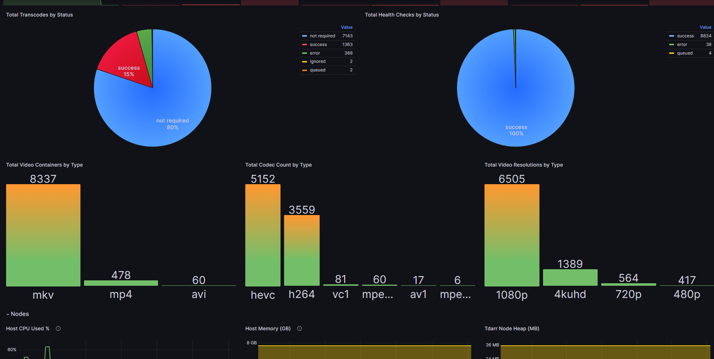
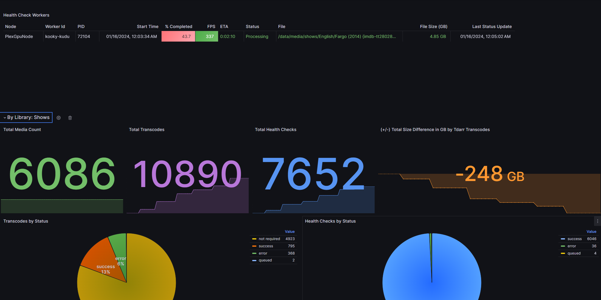
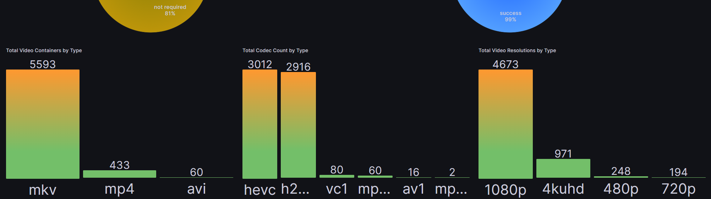
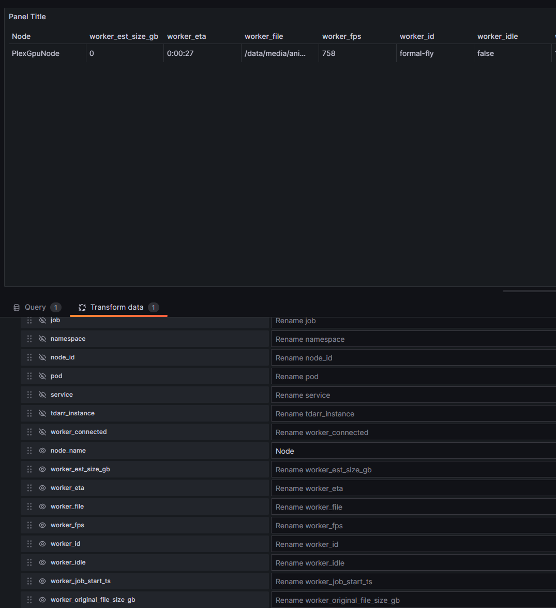

# examples
- [examples](#examples)
  - [Importing Dashboard](#importing-dashboard)
  - [Dashboard Preview](#dashboard-preview)
  - [Modifying Tables](#modifying-tables)

## Importing Dashboard
Dashboard example can be found on Grafana's portal [here](https://grafana.com/grafana/dashboards/20388).
- Copy the ID `20388` and then import it in Grafana.

Dashboard example is also provided in the `dashboard.json` file in case the dashboard from [Grafana](https://grafana.com/grafana/dashboards/20388) is not available.
- In Grafana, add a new dashboard and then copy and paste the `dashboard.json` file contents.

## Dashboard Preview

## Modifying Tables
For the `worker` tables, there are hidden fields that you can optionally show. You can choose to customize the table and hide the default fields as well. In the table edit view, click on the `Transformations` tab and then click the eye icon to toggle the visibility of the fields.

