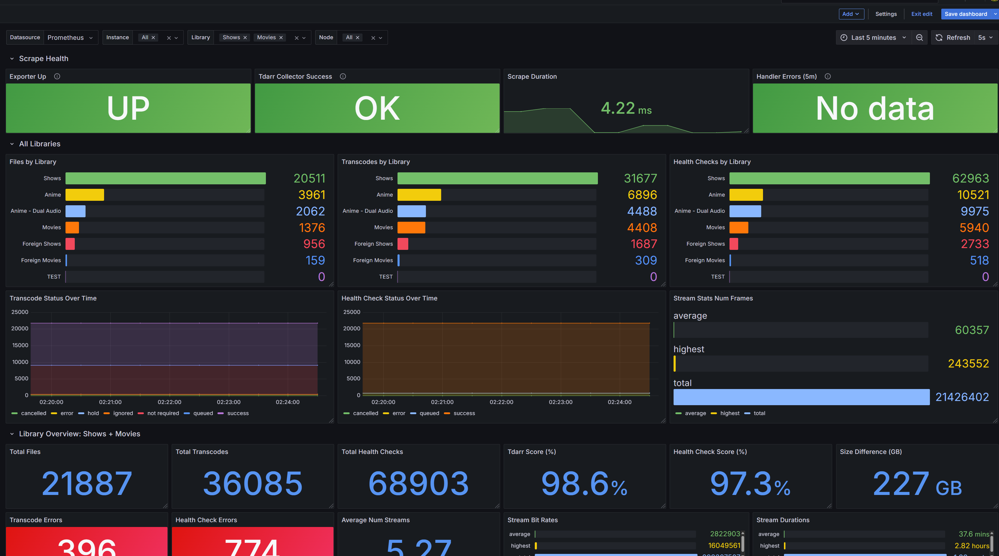
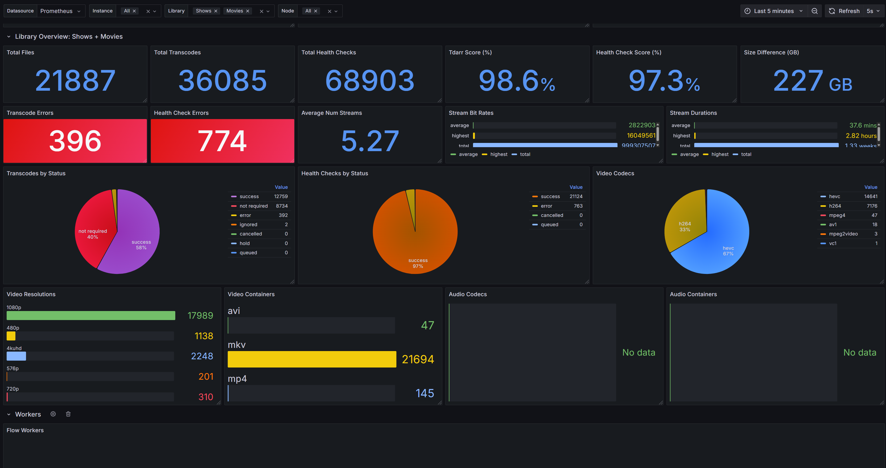
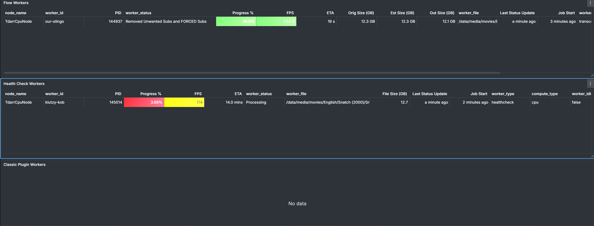
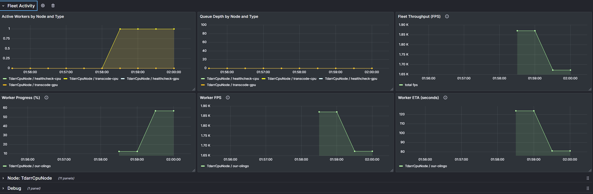
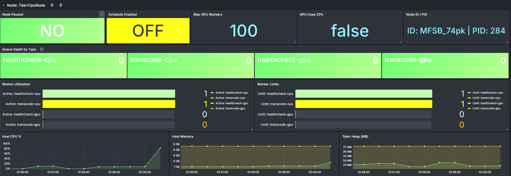
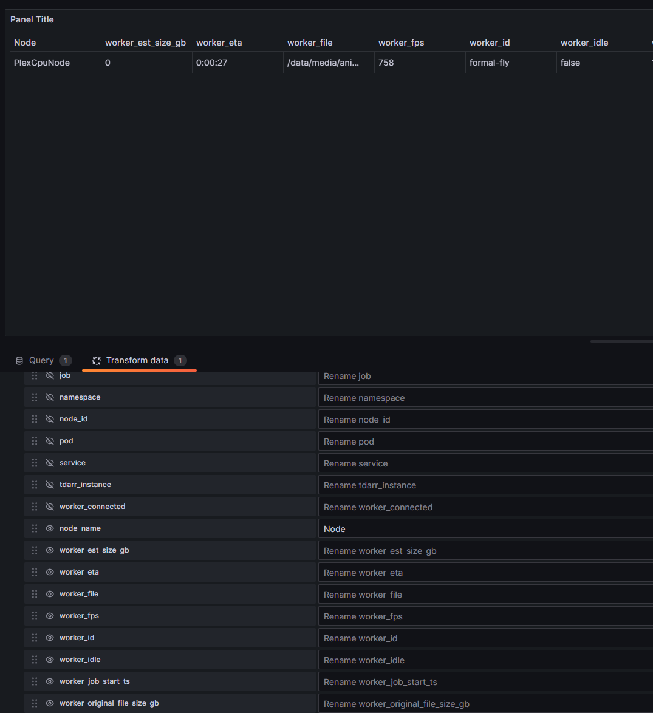

# examples
- [examples](#examples)
  - [Importing Dashboard](#importing-dashboard)
  - [Dashboard Preview](#dashboard-preview)
  - [What the Dashboard Shows](#what-the-dashboard-shows)
  - [Modifying Tables](#modifying-tables)
  - [AlertManager alerts](#alertmanager-alerts)

## Importing Dashboard
Dashboard example can be found on Grafana's portal [here](https://grafana.com/grafana/dashboards/20388).
- Copy the ID `20388` and then import it in Grafana.

Dashboard example is also provided in the `dashboard.json` file in case the dashboard from [Grafana](https://grafana.com/grafana/dashboards/20388) is not available.
- In Grafana, add a new dashboard and then copy and paste the `dashboard.json` file contents.

## Dashboard Preview

## What the Dashboard Shows

- **Scrape health row** — Prometheus `up` state, `tdarr_up`, scrape duration, and `/metrics` handler-error rate at the top, so broken scrapes surface before missing data does.
- **Node panels** — `GPU Does CPU` and `Node ID / PID` render label values directly (e.g. `false`, `ID: xyz | PID: 1234`) instead of the raw info-metric `1`.
- **Per-library breakdowns** — transcode and health-check counts aggregated client-side via `sum()`; pick libraries via `$library`.
- **Worker tables** — three tables split by role: `Flow Workers`, `Classic Plugin Workers`, `Health Check Workers`. Columns ordered `node_name, worker_id, PID, Progress %, FPS, ETA, worker_status, ...` so active progress reads left-to-right.
- **Compute split** — `worker_type` (`transcode`/`healthcheck`) and `compute_type` (`cpu`/`gpu`) are separate columns; filter or group by either.
- **Threshold coloring** — applied to worker stat cells and table progress so at-a-glance state is visible.
- **Single datasource picker** — `$datasource` drives every panel.

## Modifying Tables
For the `worker` tables, there are hidden fields that you can optionally show. You can choose to customize the table and hide the default fields as well. In the table edit view, click on the `Transformations` tab and then click the eye icon to toggle the visibility of the fields.

`Flow Workers` and `Classic Plugin Workers` use the same column order as `Health Check Workers`. Use the `Organize fields` transformation to reorder if you prefer a different layout.

## AlertManager alerts

If you're using [kube-prometheus-stack](https://artifacthub.io/packages/helm/prometheus-community/kube-prometheus-stack), you can use the included [alerts.yaml](alerts.yaml) manifest, which will trigger an alert 5 minutes after a transcode has failed.